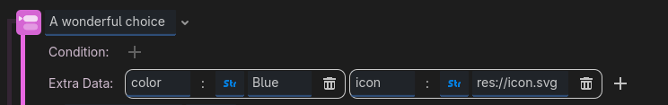

<div class="header-banner purple">
     <div class="header-label ocean">Custom Choice Button Extra Data</div>
</div>

*Sometimes you need your choices buttons to do a little more then reacting to a click and showing a text. Dialogic allows you to easily communicate between the choice event and the choice button node via an "Extra Data" dictionary. Yay.*

## 📜 Content
[toc]


## What's this about?
Dialogics default choice button can do three things:
- Show text
- Hide/Disable themselves based on a condition
- Optionally show a different text when the condition is wrong

Often you'll want a bit more, for example
- an icon
- a color
- a fancy animation

Or something else. 

To do this, you can create a custom choice button script that reacts to extra data provided on the choice event. 
This means you will have to customize your choice layer if you haven't already.

## Implementation Example
Here is an example script that you could apply to all your choice buttons.
```gdscript
extends DialogicNode_ChoiceButton

func _load_info(info:Dictionary) -> void:
    # Load text and visibility
    super(info)
    
    # Example of changing the modulation based on a string (hex-code or named color)
    modulate = Color(info.get("color", "WHITE"))

    # Example of changing the icon based on a path.
    if ResourceLoader.exists(info.get("icon", "")):
        icon = load(info.get("icon"))
    else:
        icon = null
    
    # React to all possible extra data values you might want to use 
    # (e.g. sounds, tooltips, animations, idk.)
```

For a choice button with the script above, a Choice Event could look like this: 



Which is equivalent to this in the text editor:
```dtl
- A wonderful choice | [color="Blue" icon="res://icon.svg"]
```

## Details
You choice button script should extend [DialogicNode_ChoiceButton](/classes/class_dialogicnode_choicebutton.md).

If you overwrite `_load_info()` but still want Dialogic's basic text and condition logic to apply, call `super(info)` in it. 
